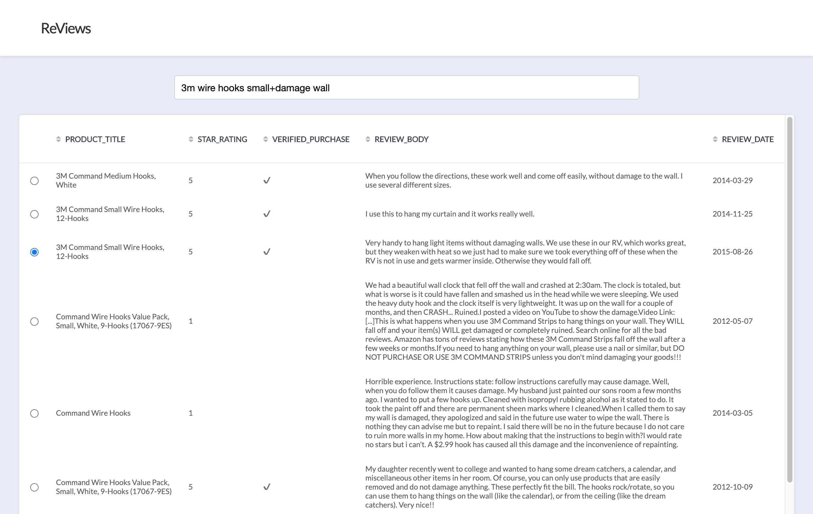
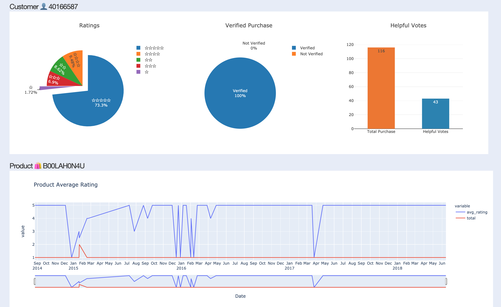
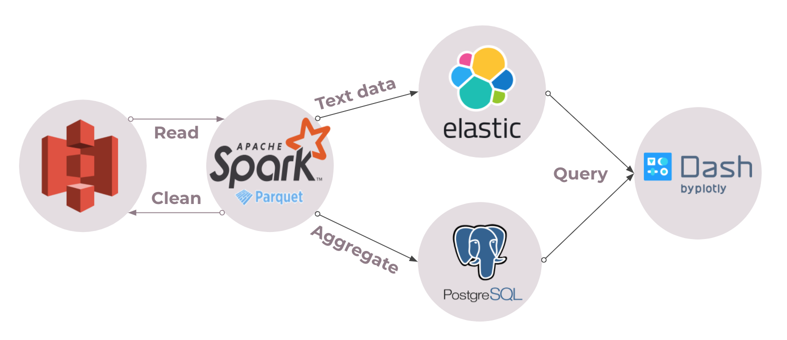

# ReViews

Insights on Amazon products based on reviews

## Introduction

This platforme is designed to provide statistical analysis for operation teams to crack down on Amazon's fraudulent reviews and for consumers to gain clarity on a product before purchase.

Live Demo: http://www.dataengprocessor.me/

- Search "product+keywords"



- Analysis



## Pipeline

1. Amazon reviews data was store on AWS S3 in ```.parquet``` and ```.json``` format.
2. Spark then read and cleaned it. Partial clean data was written back to S3 for quick access.
3. Spark did batch processing.
4. Text data (eg. review body, product title) was pushed into Elasticsearch index and analysis results, PostgreSQL.
5. Implemented frontend with Flask and Plotly Dash, which handled queries.



## Datasets

~300M reviews, ~270GB in total.

- [Amazon Customer Reviews Dataset](https://s3.amazonaws.com/amazon-reviews-pds/readme.html)
- [Amazon Review Data (2018)](https://nijianmo.github.io/amazon/index.html)

## Requirements

- Spark cluster: 4 m4.large AWS EC2 instances.
- Elasticsearch cluster: 4 m4.large AWS EC2 instances, Elastic Hadoop connector installed.
- PostgreSQL: Spark's master node, PostgreSQL JDBC driver installed.
- Flask: 1 t2.micro AWS EC2 instance.

## Setup

1. Configure AWS credentials.
2. Create Elasticsearch index and PostgreSQL database.
2. Run ```$ python ./data-processing/batch_pipeline.py```.
3. Flask application:
```
$ cd dash
$ python3 -m venv myenv
$ source myenv/bin/activate
$ pip install -r requirements.txt
$ sh start.sh
```